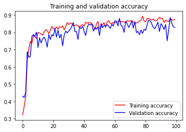
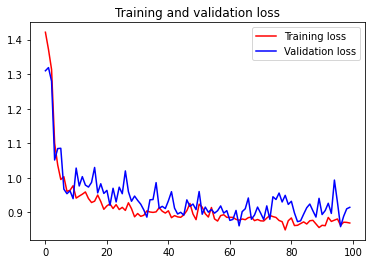
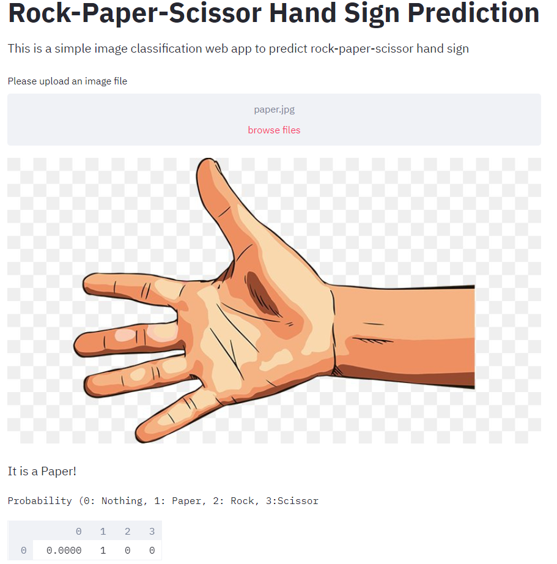
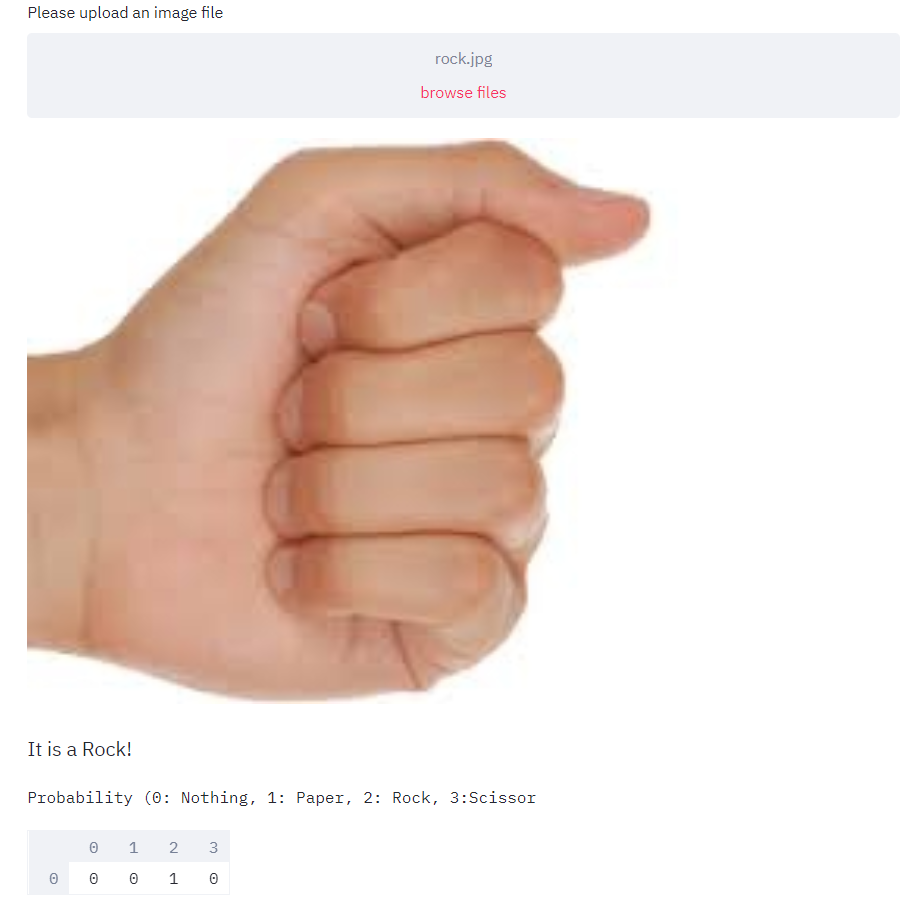
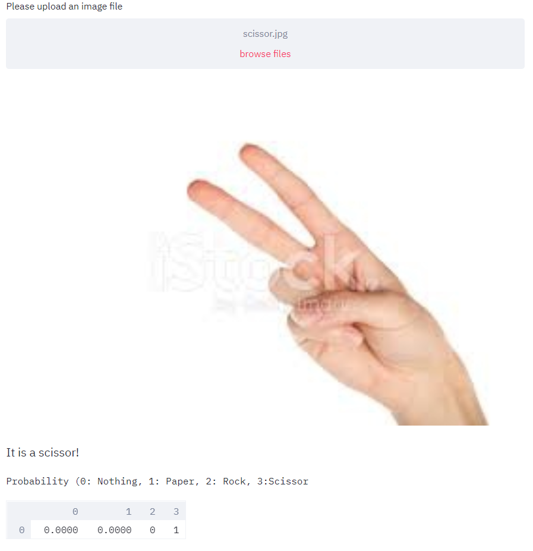

# Hand Gesture Recognition and Modification
 
## The Model
- This model _(Model_4_classes.h5)_ has been trained to detect 4 classes of objects: Paper 📜, Rock 🌍 , Scissors ✂ and Nothing(in case of none of them) using transfer learning on the InceptionV3 model till layer ‘mixed7’, followed by a Dense layer with 256 nodes (RelU), and a softmax layer with 4 output nodes using Keras with Tensorflow backend. 

- It was trained using the RMSprop optimizer with a batch size of 32 for 100 epochs. Input size of the images were (150, 150, 3). The images were rescaled and augmented before training. _(TrainInception_4classes.ipynb)_

- The dataset we used was a combination of images from the [rock-paper-scissors repository by Alessandro Giusti](https://github.com/alessandro-giusti/rock-paper-scissors/tree/master/datasets/final) and photographs clicked by each of our team members, and consisted of 1791 images in the training set and 654 images in the validation set.

- The final trained model resulted in an accuracy of 97.05% on the test set with 237 images.

- Plot of training and validation accuracy versus the number of epochs:

- Plot of training and validation loss versus the number of epochs:

## Visualizing the model 👀

- The model can be visualized using the file Visualize_4_classes.py.

- Uses OpenCV library and the webcam to do the same.

- Each frame is flipped, resized to 150x150 and then normalized before feeding into the network to make a prediction. 

- The program can be quit by hitting ‘Q’.

- Output:

  

## Deployment of Hand-Gesture-Recognition model

https://rps-streamlit-app.herokuapp.com/

- The h5 weights file of the Inception v3 model has been integrated as a [Streamlit app](https://github.com/Data-Science-Community-SRM/hand-gesture-recognition-and-modification/blob/master/Streamlit%20App/app.py) 

- The Streamlit app was deployed on Heroku PaaS

## Recognising Rock🌍,Paper📜 and Scissors✂ 

- Browse images from your system and try out the image recognition model!

## Contribute 👨‍👨‍👧‍👦

Thanks for taking the time to contribute!

The following is a set of guidelines for contributing to Hand Gesture Recognition and Modification. Please check out the [Contribute.md](https://github.com/Data-Science-Community-SRM/hand-gesture-recognition-and-modification/blob/master/Contribute.md) . These are just guidelines, not rules, so use your best judgement and feel free to propose changes to this document in a pull request.

If you have any questions, open an issue.

### Issue 

Ensure the bug was not already reported by searching on GitHub under issues. If you're unable to find an open issue addressing the bug, open a new issue.

Write detailed information. Detailed information is very helpful to understand an issue.

For example:

⚫ How to reproduce the issue, step-by-step

⚫ The expected behavior (or what is wrong)

⚫ Screenshots for issues

⚫ The operating system.

**Note:**

- The software requirements are listed in the [requirements.txt](https://github.com/Data-Science-Community-SRM/hand-gesture-recognition-and-modification/blob/master/requirements.txt) file.

### Pull Requests

Pull Requests are always welcome.

## License

MIT © Data Science Community SRM

This project is licensed under the MIT License - see the [License.md](https://github.com/Data-Science-Community-SRM/hand-gesture-recognition-and-modification/blob/master/License.md) file for details

