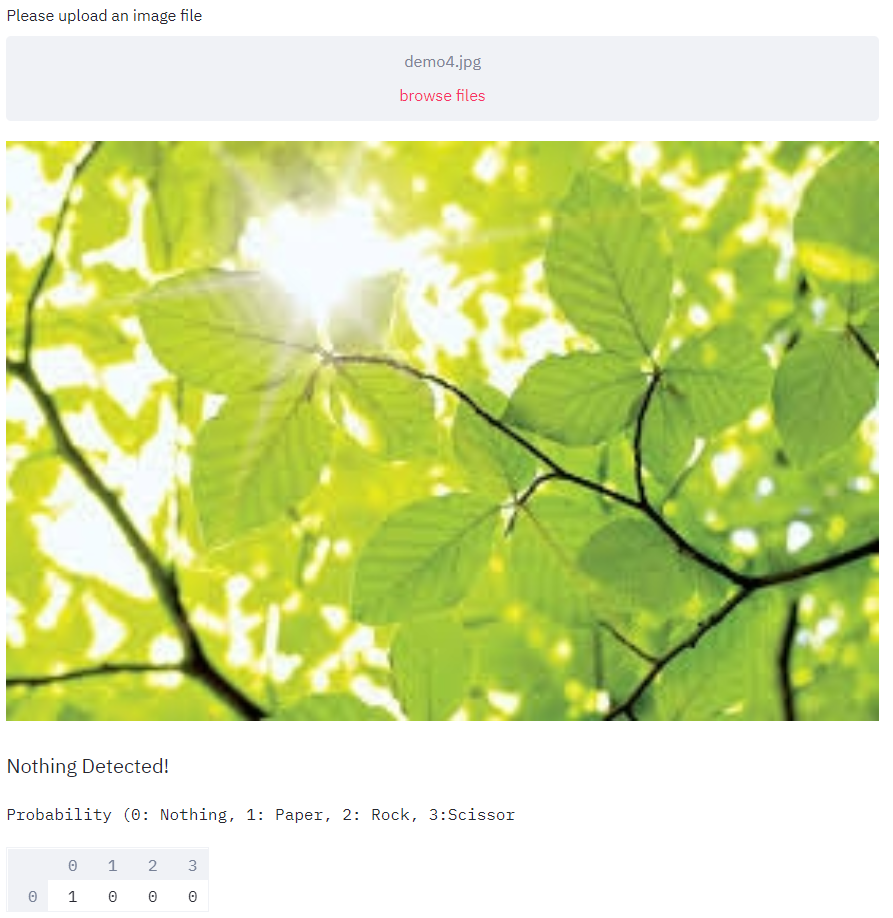

	<h2 align="center"> Hand Gesture Recognition and Modification </h2>
	<h4 align="center"> Image classification of Rock🌍,Paper📜 and Scissors✂ hand symbols <h4>

	
## Preview

- Output:

  

- Browse images from your system and try out the image recognition model! 

  

  

  

  

## Functionalities
- [ ]  This model ([Model_4_classes.h5](https://github.com/Data-Science-Community-SRM/hand-gesture-recognition-and-modification/blob/master/Flask%20app/static/Model_4_classes.h5)) has been trained to detect 4 classes of objects: Paper 📜, Rock 🌍 , Scissors ✂ and Nothing(in case of none of them) using transfer learning on the InceptionV3 model till layer ‘mixed7’, followed by a Dense layer with 256 nodes (RelU), and a softmax layer with 4 output nodes using Keras with Tensorflow backend. 
- [ ]  It was trained using the RMSprop optimizer with a batch size of 32 for 100 epochs. Input size of the images were (150, 150, 3). The images were rescaled and augmented before training. ([TrainInception_4classes.ipynb](https://github.com/Data-Science-Community-SRM/hand-gesture-recognition-and-modification/blob/master/Inception-Model/TrainInception_4classes.ipynb))
- [ ]  The [h5 weights file](https://github.com/Data-Science-Community-SRM/hand-gesture-recognition-and-modification/blob/master/Flask%20app/static/Model_4_classes.h5) of the Inception v3 model has been integrated as a [Streamlit app](https://github.com/Data-Science-Community-SRM/hand-gesture-recognition-and-modification/blob/master/Streamlit%20App/app.py) 
The Streamlit app has been deployed on Heroku PaaS
- [ ]  The final trained model resulted in an accuracy of 97.05% on the test set with 237 images.
- [ ]  The model can be visualized using the file Visualize_4_classes.py and Uses OpenCV library and the webcam to do the same. Each frame is flipped, resized to 150x150 and then normalized before feeding into the network to make a prediction. 
Plot of training and validation accuracy versus the number of epochs:

  

 Plot of training and validation loss versus the number of epochs:

  

 

- [ ] The program can be quit by hitting ‘Q’.

## Contribute 👨‍👨‍👧‍👦

Thanks for taking the time to contribute!

The following is a set of guidelines for contributing to Hand Gesture Recognition and Modification. Please check out the [Contribute.md](https://github.com/Data-Science-Community-SRM/hand-gesture-recognition-and-modification/blob/master/Contribute.md) . These are just guidelines, not rules, so use your best judgement and feel free to propose changes to this document in a pull request.
If you have any questions, open an issue.

**Note:**

- The software requirements are listed in the [requirements.txt](https://github.com/Data-Science-Community-SRM/hand-gesture-recognition-and-modification/blob/master/requirements.txt) file.

## License

MIT © Data Science Community SRM

This project is licensed under the MIT License - see the [License.md](https://github.com/Data-Science-Community-SRM/hand-gesture-recognition-and-modification/blob/master/License.md) file for details

	Made with :heart: by <a href="https://dscommunity.in">DS Community SRM</a>

